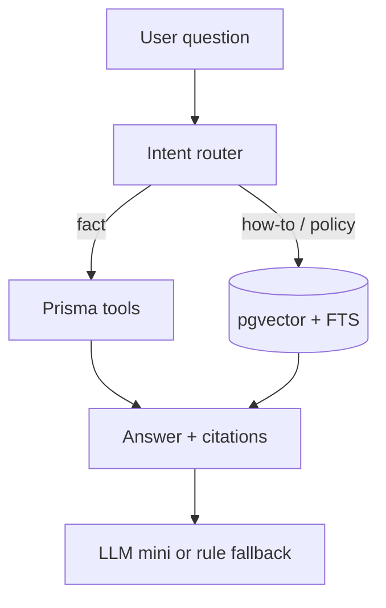

# dnPeople HR Chatbot (RAG + tools)

## Document Info

> **Author:** Dozer  
> **Date:** 2026-08-31

| Field | Value |
|-------|-------|
| **Author** | Dozer |
| **Status** | Implemented in repo (v17.0 assistant tools + FAQ/policy RAG) |
| **Created** | 2026-08-31 |
| **Last Updated** | 2026-08-31 |
| **Reviewers** | Engineering, Legal (UU PDP) |
| **Target Release** | v17.0 — after ops go-live and Career Marketplace P0, not in parallel with licensed PSP |

---

## Problem Statement

### What problem are we solving?

Karyawan dan HR menanyakan hal yang sama berulang: sisa cuti, jam clock-in, cara bayar invoice, isi SOP perusahaan. Jawaban tersebar di FAQ, tutorial, dan tabel Prisma. Asisten yang ada hari ini (`/assistant`, fitur `ai:assistant`, tier Enterprise) hanya keyword-match + satu panggilan LLM tanpa sitasi dan tanpa retrieval kebijakan tenant.

### Who is affected?

- Karyawan (self-service cuti/absen/slip)
- HR/Admin (headcount, pending leave, kontrak)
- CS DN Tech (tiket “cara pakai produk”)

### How do we know this is a problem?

- Kode: `backend/src/lib/assistant.ts` — `ruleBasedAnswer` if-substring; LLM tidak melihat `companyPolicy.body`
- Produk: FAQ di `docs/FAQ-KNOWLEDGE-BASE.md` tidak di-index
- PRD v14.0 menandai “Chatbot AI assistant” sebagai future, padahal UI `/assistant` sudah ada

### What happens if we do nothing?

LLM mengarang angka gaji; HR tetap jadi helpdesk; tiket how-to tidak turun. Biaya token naik tanpa kualitas (satu model untuk semua pertanyaan).

**Bukan untuk Catat Duit:** PRD personal tracker (1 user, 1–2 minggu, tanpa auth) tidak butuh chatbot. Input form lebih cepat dan lebih akurat daripada percakapan.

---

## User Stories

| # | As a... | I want to... | So that... | Priority |
|---|---------|-------------|-----------|----------|
| 1 | Karyawan | Tanya sisa cuti / clock-in / slip sendiri | Tidak menunggu HR | Must Have |
| 2 | HR | Tanya pending cuti dan kontrak ≤30 hari | Triage pagi tanpa buka 4 halaman | Must Have |
| 3 | Siapa pun di tenant | Dapat jawaban SOP dengan judul sumber | Percaya dan bisa dicek | Must Have |
| 4 | Karyawan | Dapat langkah how-to (ajukan cuti, bayar invoice) | Selesai tanpa tiket | Should Have |
| 5 | Admin | Lihat log percakapan + token | Audit UU PDP dan biaya | Should Have |
| 6 | Karyawan | Ajukan cuti lewat chat | Tidak isi form | Won't Have (v1) |

---

## Solution Overview

### Proposed Solution

Perluas `/assistant` menjadi **satu agent** (bukan swarm): router aturan → tool Prisma read-only **atau** RAG chunk → jawaban ID singkat + sitasi. Fallback rule-based jika LLM down (sudah ada).

`agent_planner.py` mengusulkan **swarm + web_search/code_executor**. Ditolak: skill table “single agent jika satu tugas terbatas, < ~5 tools”; tim 3 orang; search web membuka data HR ke internet.

### Key User Flows

1. **Fakta HR:** “Sisa cuti saya?” → tool `leave_balance` (employeeId dari session) → angka dari DB, bukan embedding.
2. **How-to produk:** “Bagaimana bayar invoice?” → retrieve chunk FAQ → jawab + tautan `/billing`.
3. **SOP tenant:** “Berapa hari cuti tahunan?” → retrieve `companyPolicy` company_id = session → sitasi judul kebijakan.
4. **Tolak:** “Berapa gaji Budi?” → refuse + arahkan ke HR.

### How It Works

```
Pertanyaan
  ├─ Intent: fact → tools (Prisma, tenant + self scope)
  ├─ Intent: how-to → RAG product KB (FAQ / USER-GUIDE chunks)
  ├─ Intent: policy → RAG tenant policies
  └─ else → refuse / “hubungi HR”
Jawaban = generator kecil (tier mini) + citations[]
Jika LLM error → ruleBasedAnswer (existing)
```

---

## Success Metrics

| Metric | Current | Target | Timeframe |
|--------|---------|--------|-----------|
| Containment (tidak eskalasi ke HR) how-to | n/a | ≥ 40% pertanyaan FAQ-like | 60 hari GA |
| Hallucinated numeric HR facts | unknown | **0** sampled weekly | ongoing |
| p95 latency `/assistant/ask` | unmeasured | ≤ 8s | GA |
| Precision@1 retrieval (chunk-level gold set) | 0.00 doc-level baseline | ≥ 0.80 | before GA |
| Cost per successful answer | unlogged | log + cap per company | GA |

### How We Will Measure

Event: `assistant_ask` {intent, mode, tokens_in, tokens_out, latency_ms, citation_count, refused}. Sampling 25 percakapan/minggu untuk angka vs DB.

---

## RICE (capacity 8 person-months / kuartal)

Script: `rice_prioritizer.py` (2026-08-31). Reach ≈ 80 pengguna aktif assistant (Enterprise + beta).

| Rank | Feature | RICE | Effort |
|------|---------|------|--------|
| 1 | HR fact tools (cuti/absen/gaji) | 53.3 | S |
| 1 | Citations + refuse | 53.3 | S |
| 3 | Tenant policy RAG | 38.4 | M |
| 4 | Product FAQ RAG | 32.0 | M |
| 5 | In-app chat polish | 26.7 | S |
| 6 | WhatsApp bot | 23.1 | XL — defer |
| 7 | Conversation audit log | 13.3 | S — **naikkan ke v1** (compliance) |
| 8 | Leave-submit agent | 10.0 | L — defer |

Roadmap tool menaruh audit di Q5; **override PM:** audit token + tenant_id wajib di sprint yang sama dengan tools (UU PDP, cost optimizer).

**Portfolio:** max satu item L/XL per kuartal. WhatsApp dan write-agent tidak masuk v17.

---

## RAG (corpus-driven)

Corpus uji (5 dokumen user-facing, 14 208 karakter): FAQ, USER-GUIDE, ADMIN-GUIDE, onboarding playbook, SLA.

**Chunking (`chunking_optimizer.py`):** strategi terbaik **sentence_based** (skor 0.53; chunk rata-rata 943 karakter; 67% boundary kalimat). Designer mengusulkan `adaptive_chunking` karena mixed types — untuk v1 pakai **satu chunk per Q&A FAQ** (lebih ketat dari sentence_based pada FAQ) + heading chunks untuk USER-GUIDE.

**Pipeline (`rag_pipeline_designer.py`, scale small):**

| Layer | Pilihan | Catatan |
|-------|---------|---------|
| Embed | Fast / self-hosted: `all-MiniLM-L6-v2` (kandidat; verifikasi model + harga **as-of 2026-08-31**) | Cost-sensitive; kualitas API opsional nanti |
| Vector | **pgvector** di Postgres yang sudah ada | Jangan Pinecone di MVP |
| Retrieve | Hybrid (dense + keyword) | Wajib: TF-IDF dokumen utuh gagal P@1 |
| Rerank | Cross-encoder opsional v1.1 | Designer +$12/bln estimasi — verifikasi |

Estimasi biaya designer **$82/bln** termasuk hosting PG $50 + eval $20 — **bukan harga live**. Isi kolom `model \| $/1M tokens (verify) \| dims \| as-of` sebelum beli API.



### Retrieval eval (baseline, **document-level TF-IDF**)

8 query gold vs 5 file utuh:

| Metric | Score | vs floor skill (P@5 ≥ 0.8, R@10 ≥ 0.85) |
|--------|-------|------------------------------------------|
| Precision@1 | **0.00** | Gagal — FAQ kalah dari ADMIN-GUIDE |
| Precision@5 | 0.40 | Gagal |
| Recall@5 | **1.00** | Lolos karena corpus kecil |
| MRR | 0.41 | — |
| NDCG@5 | 0.58 | — |

**Satu variabel untuk loop berikutnya (wajib sebelum GA):** ganti unit retrieval dari *file* ke *chunk Q&A*; ulangi `retrieval_evaluator.py` pada corpus chunk. Jangan naikkan embedding tier dulu.

---

## Technical Requirements

### System Requirements

- p95 ask ≤ 8s; tool path ≤ 1s
- Tenant isolation: `companyId` dari session di setiap query vector
- Karyawan: payroll/leave hanya `employeeId` sendiri
- `max_tokens` + model routing: fact = no LLM jika tool cukup; how-to = mini
- Log token per request (llm-cost-optimizer: tidak ada baseline hari ini)

### Dependencies

- v1 **shipped:** FAQ markdown Q&A chunks + lexical retrieve (no pgvector yet); `CompanyPolicy` live query per ask
- v1.1: `pgvector` + MiniLM jika P@1 FAQ gold turun di corpus lebih besar
- Existing `OPENAI_API_KEY` / `LLM_*` optional (facts = tools only; how-to may synthesize)

### Security & Privacy

- Tidak embed gaji, NIK, rekening
- Sitasi hanya judul + chunk_id, bukan dokumen rahasia ke karyawan tanpa ACL
- Retention percakapan 90 hari (selaras planner constraint)
- Rate limit per user

---

## Timeline

| Phase | Window | Deliverables |
|-------|--------|----------------|
| 0 | 1 minggu | Gold set 30 Q (FAQ + 10 policy fiktif); eval chunk-level |
| 1 | 2 minggu | Tools typed (leave, attendance, payroll self, pending HR); citations; refuse; audit log |
| 2 | 3 minggu | FAQ chunk index + hybrid retrieve; P@1 ≥ 0.8 on gold |
| 3 | 3 minggu | Tenant policy indexer + ACL |
| Beta | 2 minggu | 1–2 tenant Enterprise; weekly hallucination review |
| GA | — | Flag `ai:assistant` tetap; docs USER-GUIDE update |

---

## Risks

| Risk | Likelihood | Impact | Mitigation |
|------|-----------|--------|------------|
| Angka gaji salah | Med | High | Tools first; LLM dilarang mengarang angka |
| Policy salah tenant | Low | High | `company_id` wajib di filter pgvector |
| Eval P@1 0 pada file utuh | High | Med | Chunk Q&A sebelum GA |
| Scope swarm/WhatsApp | Med | High | ADR: single agent, no write tools |
| Biaya LLM | Med | Med | Router; cache FAQ answers; cap per company |

---

## Out of Scope (v17)

- Chatbot Catat Duit / produk non-HRIS
- WhatsApp / BSP
- Agent yang **menulis** cuti, absen, payroll
- Licensed PSP / payment chatbot
- Multi-agent swarm, web search, code execution
- Fine-tune model sendiri

---

## Decision Log

| # | Decision | Date | Decided By | Rationale |
|---|----------|------|-----------|-----------|
| 1 | Extend `/assistant`, jangan produk baru | 2026-08-31 | Dozer | Surface + flag sudah ada |
| 2 | Single agent, bukan swarm | 2026-08-31 | Dozer | Planner swarm ditolak — tim kecil, <5 tools |
| 3 | pgvector | 2026-08-31 | Dozer | Sudah Postgres; hindari vector DB kedua |
| 4 | Facts via tools, bukan RAG | 2026-08-31 | Dozer | Angka harus ACID |
| 5 | Audit log di v1 meski RICE rendah | 2026-08-31 | Dozer | UU PDP + cost observability |

---

## Change History

| Version | Date | Author | Changes |
|---------|------|--------|---------|
| 0.1 | 2026-08-31 | Dozer | Draft dari RICE + RAG eval + override arsitektur |
| 0.2 | 2026-08-31 | Dozer | v1 di repo: tools Prisma, refuse, FAQ P@1=1.0 (8 query), policy lexical, audit ASK |
