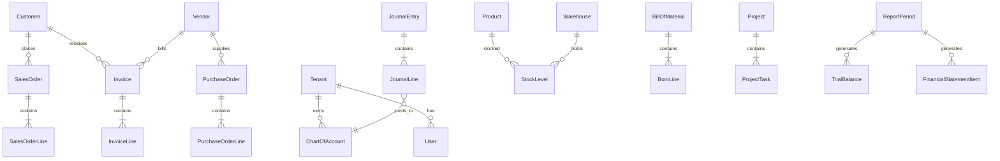

# dnPeople — Fitur per Modul & Skema Database

**Terakhir diperbarui:** 3 Juli 2026  
**Stack:** NestJS 10 + TypeORM + PostgreSQL (atau `DB_MODE=memory` untuk demo)  
**API base:** `/api/v1` · **Swagger:** `/api/docs`

Dokumen ini merangkum **kegunaan**, **fitur utama**, dan **skema data** setiap modul backend dnPeople, beserta halaman UI terkait.

---

## Konvensi Umum

| Aspek | Keterangan |
|-------|------------|
| Multi-tenant | Semua entitas bisnis memiliki kolom `tenantId` (isolasi row-level) |
| Auth | JWT Bearer token; role: `SUPER_ADMIN`, `ADMIN`, `FINANCE_*`, `USER`, dll. |
| Audit | Semua mutasi penting tercatat di `audit_logs` via interceptor |
| GL integration | Event-driven: Sales→AR→GL, PO→Inventory→GL, MO→GL |
| Frontend | React SPA di `frontend/src/pages/` |

---

## 1. Auth & Users

### Kegunaan
Autentikasi, registrasi tenant baru, manajemen sesi, 2FA, SSO Google, OAuth2 client credentials, reset password, dan profil pengguna.

### Fitur
- Register tenant + admin (slug auto-generate dari nama perusahaan)
- Login email/password + refresh token
- 2FA TOTP (setup, enable, verifikasi saat login)
- Password reset via email token
- SSO Google (`id_token`)
- OAuth2 `client_credentials` via API key
- Throttling brute-force login
- Admin CRUD user (modul Users)

### Skema

| Tabel | Entity | Kolom utama | Relasi |
|-------|--------|-------------|--------|
| `tenants` | `Tenant` | `name`, `slug`, `plan`, `status`, `defaultCurrency`, `timezone` | 1→N `users` |
| `users` | `User` | `email`, `passwordHash`, `firstName`, `lastName`, `roles[]`, `twoFactorEnabled`, `twoFactorSecret`, `isActive` | N→1 `tenants` |

### API & UI
| Area | Path |
|------|------|
| API | `POST /auth/register`, `/login`, `/refresh`, `/2fa/*`, `/sso/login`, `/password-reset/*`, `GET /auth/profile` |
| Users API | `GET/POST/PUT/DELETE /users` |
| UI | `/login`, `/register`, `/forgot-password`, `/reset-password`, `/settings/2fa`, `/settings/users` |

---

## 2. Tenants

### Kegunaan
Manajemen organisasi SaaS — info tenant aktif, plan subscription, dan quota resource.

### Fitur
- Lihat tenant saat ini (dari JWT)
- Cek quota (user count, modul, dll.)
- Provisioning workflow saat register

### Skema
Menggunakan tabel `tenants` (lihat Auth). Enum `SubscriptionPlan`: STARTUP, BUSINESS, ENTERPRISE. Enum `TenantStatus`: TRIAL, ACTIVE, SUSPENDED.

### API & UI
| Area | Path |
|------|------|
| API | `GET /tenants/current`, `/tenants/current/quota` |
| UI | `/settings/general` (billing/plan info) |

---

## 3. Finance (GL, AR, AP, Indonesia, e-Faktur)

### Kegunaan
Inti akuntansi ERP — General Ledger, piutang (AR), hutang (AP), periode fiskal, pajak Indonesia (PPN/PPh21), e-Faktur, rekonsiliasi bank, expense claim, dan integrasi otomatis ke GL dari modul lain.

### Fitur

**General Ledger (`/finance/gl`)**
- Chart of Accounts (COA) — termasuk seed SAK-EP Indonesia
- Journal entry + reversal
- Trial balance, balance sheet, P&L
- Accounting period open/close + pre-close checklist
- Intercompany posting

**Accounts Receivable (`/finance/ar`)**
- Customer master + credit limit
- Invoice AR, payment, credit memo
- Buat invoice dari sales order
- AR aging report

**Accounts Payable (`/finance/ap`)**
- Vendor master + vendor scoring
- Invoice AP, approve, schedule payment, early discount
- Debit memo
- AP aging report
- Payment file export (BCA CSV / SEPA)

**Indonesia SAK-EP (`/finance/*`)**
- Seed COA Indonesia, transaksi domestic/export/purchase/salary PPh21
- Hitung PPN & PPh21, tax compliance report
- Laporan: neraca, laba rugi, arus kas, perubahan ekuitas

**e-Faktur (`/finance/efaktur`)**
- Generate dokumen e-Faktur, export XML
- Validasi NPWP

**Advanced (`/finance/advanced`)**
- Bank account & transaksi, rekonsiliasi
- Expense claim (approve/reject)
- Three-way match (PO ↔ GR ↔ Invoice)
- Dunning run, cash flow forecast

### Skema

| Tabel | Entity | Kolom utama | Relasi |
|-------|--------|-------------|--------|
| `chart_of_accounts` | `ChartOfAccount` | `code`, `name`, `accountType`, `sakAccountType`, `parentId`, `balance` | Self-ref parent |
| `journal_entries` | `JournalEntry` | `entryNumber`, `entryDate`, `status`, `description` | 1→N `journal_lines` |
| `journal_lines` | `JournalLine` | `debit`, `credit`, `description` | N→1 entry, N→1 account |
| `customers` | `Customer` | `code`, `name`, `creditLimit`, `creditBlocked`, `npwp` | — |
| `vendors` | `Vendor` | `code`, `name`, `paymentTerms`, `vendorScore` | — |
| `invoices` | `Invoice` | `type` (AR/AP), `documentKind` (INVOICE/CREDIT_MEMO/DEBIT_MEMO), `status`, amounts | N→1 customer/vendor; 1→N lines |
| `invoice_lines` | `InvoiceLine` | `description`, `quantity`, `unitPrice`, `amount` | N→1 invoice |
| `accounting_periods` | `AccountingPeriod` | `name`, `startDate`, `endDate`, `status` | — |
| `finance_tax_records` | `TaxRecord` | `period`, `taxType`, `baseAmount`, `taxAmount` | Ref journal |
| `efaktur_documents` | `EFakturDocument` | `invoiceNumber`, `buyerNpwp`, `dpp`, `ppn`, `xmlPayload` | — |
| `bank_accounts` | `BankAccount` | `accountNumber`, `bankName`, `balance`, `currency` | — |
| `bank_transactions` | `BankTransaction` | `amount`, `isReconciled`, `reference` | N→1 bank account |
| `expense_claims` | `ExpenseClaim` | `amount`, `status`, `description` | Ref employee |

### API & UI
| Area | Path |
|------|------|
| UI | `/finance/accounts`, `/finance/journal`, `/finance/ar`, `/finance/ap`, `/finance/periods`, `/finance/indonesia`, `/finance/efaktur`, `/finance/expenses` |

---

## 4. Sales

### Kegunaan
Siklus penjualan — quotation → order → konfirmasi → pengiriman → invoice AR → retur.

### Fitur
- Sales quotation + konversi ke order
- Sales order CRUD, confirm, ship, deliver, return
- Credit limit check saat confirm
- Volume pricing / discount
- Dashboard penjualan
- Auto-posting ke AR & GL saat confirm/invoice

### Skema

| Tabel | Entity | Kolom utama | Relasi |
|-------|--------|-------------|--------|
| `sales_quotations` | `SalesQuotation` | `quotationNumber`, `validUntil`, `status`, totals | N→1 customer; 1→N lines |
| `sales_quotation_lines` | `SalesQuotationLine` | `quantity`, `unitPrice`, `amount` | N→1 quotation |
| `sales_orders` | `SalesOrder` | `orderNumber`, `status`, `subtotal`, `taxAmount`, `totalAmount` | N→1 customer; 1→N lines |
| `sales_order_lines` | `SalesOrderLine` | `productId`, `quantity`, `unitPrice` | N→1 order |

### API & UI
| Area | Path |
|------|------|
| API | `GET/POST /sales/orders`, `POST /orders/:id/confirm|ship|deliver|return`, `GET/POST /sales/quotations`, `POST /quotations/:id/convert` |
| UI | `/sales/orders`, `/sales/quotations` |

---

## 5. Supply Chain (Inventory & Procurement)

### Kegunaan
Master produk, gudang, stok real-time, purchase order, goods receipt, transfer antar gudang, MRP, dan reorder alert.

### Fitur
- Product CRUD + barcode
- Warehouse management
- Stock level per produk/gudang, stock movement
- Transfer stok antar warehouse
- Purchase order + receive (GR)
- MRP suggestion, reorder alerts
- Dashboard supply chain
- Auto-posting inventory ke GL saat GR

### Skema

| Tabel | Entity | Kolom utama | Relasi |
|-------|--------|-------------|--------|
| `products` | `Product` | `sku`, `name`, `unitPrice`, `costPrice`, `reorderPoint`, `barcode` | — |
| `warehouses` | `Warehouse` | `code`, `name`, `address` | — |
| `stock_levels` | `StockLevel` | `quantity`, `reservedQuantity` | Composite: product + warehouse |
| `stock_movements` | `StockMovement` | `type`, `quantity`, `reference` | Ref product, warehouse |
| `purchase_orders` | `PurchaseOrder` | `poNumber`, `status`, `totalAmount` | N→1 vendor; 1→N lines |
| `purchase_order_lines` | `PurchaseOrderLine` | `productId`, `quantity`, `unitPrice` | N→1 PO |

### API & UI
| Area | Path |
|------|------|
| API | `GET/POST/PUT/DELETE /supply-chain/products`, `/warehouses`, `/stock`, `/movements`, `/transfer`, `/purchase-orders`, `POST /purchase-orders/:id/receive` |
| UI | `/inventory/products`, `/inventory/warehouses`, `/inventory/stock`, `/inventory/purchase-orders` |

---

## 6. HR (Human Resources)

### Kegunaan
Manajemen karyawan, cuti, absensi, payroll dasar (termasuk PPh21), rekrutmen ATS, lembur, dan performance review.

### Fitur
- Employee master (PTKP, BPJS, gaji)
- Leave request + approval + saldo cuti
- Attendance check-in/out
- Payroll run + payslip export (CSV)
- SPT Masa PPh21 XML export
- Recruitment pipeline (ATS)
- Overtime request + approval
- Performance reviews (via Enterprise module)

### Skema

| Tabel | Entity | Kolom utama | Relasi |
|-------|--------|-------------|--------|
| `employees` | `Employee` | `employeeNumber`, name, `department`, `salary`, `ptkpStatus`, `bpjsAmount`, `status` | — |
| `leave_requests` | `LeaveRequest` | `leaveType`, `startDate`, `endDate`, `status` | N→1 employee |
| `attendance_records` | `AttendanceRecord` | `date`, `checkIn`, `checkOut` | N→1 employee |
| `payroll_runs` | `PayrollRun` | `periodLabel`, `payDate`, totals, `employeeDetails` (JSONB) | — |
| `job_applications` | `JobApplication` | `applicantName`, `position`, `status` | — |
| `overtime_records` | `OvertimeRecord` | `hours`, `status`, `date` | N→1 employee |
| `performance_reviews` | `PerformanceReview` | `period`, `rating`, `comments` | Ref employee (Enterprise) |

### API & UI
| Area | Path |
|------|------|
| API | `/hr/employees`, `/leave-requests`, `/attendance`, `/payroll`, `/recruitment`, `/overtime` |
| UI | `/hr/employees`, `/hr/leave`, `/hr/payroll`, `/hr/performance` |

---

## 7. Manufacturing

### Kegunaan
Bill of Materials (BOM), manufacturing order (MO), scrap tracking, dan capacity planning.

### Fitur
- BOM create + versioning
- Manufacturing order: start → complete → scrap
- Capacity planning dashboard
- Work orders & QC (via Enterprise module)
- Auto-posting COGS/WIP ke GL saat complete

### Skema

| Tabel | Entity | Kolom utama | Relasi |
|-------|--------|-------------|--------|
| `bill_of_materials` | `BillOfMaterial` | `code`, `version`, `productId`, `parentBomId` | 1→N `bom_lines` |
| `bom_lines` | `BomLine` | `componentProductId`, `quantity` | N→1 BOM |
| `manufacturing_orders` | `ManufacturingOrder` | `plannedQuantity`, `producedQuantity`, `scrapQuantity`, `status` | N→1 BOM, product |

### API & UI
| Area | Path |
|------|------|
| API | `GET/POST /manufacturing/bom`, `POST /bom/:id/version`, `GET/POST /manufacturing/orders`, `POST /orders/:id/start|complete|scrap` |
| UI | `/manufacturing/boms`, `/manufacturing/orders`, `/manufacturing/work-orders`, `/manufacturing/qc` |

---

## 8. Projects

### Kegunaan
Project management — proyek, task, dependency, time tracking, budget, dan billable hours.

### Fitur
- Project CRUD + budget vs actual
- Task management + dependency antar task
- Time entry + approval workflow
- Utilization report
- Billable time tracking

### Skema

| Tabel | Entity | Kolom utama | Relasi |
|-------|--------|-------------|--------|
| `projects` | `Project` | `code`, `name`, `status`, `budget`, `actualCost`, `startDate`, `endDate` | 1→N tasks |
| `project_tasks` | `ProjectTask` | `name`, `status`, `estimatedHours`, `loggedHours`, `dependsOnTaskId` | N→1 project |
| `time_entries` | `TimeEntry` | `hours`, `isBillable`, `approvalStatus`, `date` | Ref project, task, user |

### API & UI
| Area | Path |
|------|------|
| API | `GET/POST /projects`, `POST /:id/tasks`, `POST /time-entries`, `GET /:id/budget`, `/utilization` |
| UI | `/projects/list`, `/projects/tasks`, `/projects/timesheets` |

---

## 9. CRM

### Kegunaan
Customer relationship — lead, opportunity pipeline, dan log komunikasi.

### Fitur
- Lead management (CRUD)
- Opportunity pipeline dengan stage & probability
- Communication log per customer/lead
- Pipeline dashboard

### Skema

| Tabel | Entity | Kolom utama | Relasi |
|-------|--------|-------------|--------|
| `crm_leads` | `Lead` | `name`, `email`, `company`, `status`, `source` | — |
| `crm_opportunities` | `Opportunity` | `stage`, `amount`, `probability`, `expectedCloseDate` | Ref customer, lead |
| `crm_communications` | `CommunicationLog` | `type`, `subject`, `content` | Ref customer/lead |

### API & UI
| Area | Path |
|------|------|
| API | `GET /crm/pipeline`, `GET/POST/PUT/DELETE /crm/leads`, `/opportunities`, `/communications` |
| UI | `/crm/leads`, `/crm/opportunities`, `/crm/pipeline` |

---

## 10. Fixed Assets

### Kegunaan
Register aset tetap, depresiasi otomatis, dan maintenance schedule.

### Fitur
- Asset register CRUD
- Depreciation run (straight-line, declining balance)
- Maintenance log per asset
- Book value tracking

### Skema

| Tabel | Entity | Kolom utama | Relasi |
|-------|--------|-------------|--------|
| `fixed_assets` | `FixedAsset` | `assetCode`, `acquisitionCost`, `method`, `accumulatedDepreciation`, `bookValue`, `status` | — |
| `asset_maintenance` | `AssetMaintenance` | `maintenanceDate`, `cost`, `description` | N→1 asset |

### API & UI
| Area | Path |
|------|------|
| API | `GET/POST /fixed-assets`, `POST /depreciation/run`, `GET/POST /:id/maintenance` |
| UI | `/fixed-assets/list`, `/fixed-assets/depreciation` |

---

## 11. Reporting (SAK-EP & Executive)

### Kegunaan
Dua lapisan: dashboard eksekutif cross-module dan engine pelaporan keuangan penuh sesuai SAK-EP (Indonesia).

### Fitur

**Executive (`/reports/*`)**
- Dashboard KPI agregat semua modul
- Balance sheet, P&L, cash flow ringkas
- SAK statements preview

**Financial Reporting (`/reporting/*`)**
- Report period management + audit trail
- Trial balance detail
- Laporan wajib: neraca, laba rugi, arus kas, perubahan ekuitas
- Consolidated statements (multi-entity)
- Segment reporting, related-party, sensitivity analysis
- Budget vs actual, trend, tax filing, regulatory export
- Financial notes (SAK disclosures)
- Validasi compliance + drill-down
- Export PDF/XML + signed download URL
- RBAC workflow: Finalize → Approve → Publish + email notifikasi
- Custom report builder (Enterprise)

### Skema

| Tabel | Entity | Kolom utama | Relasi |
|-------|--------|-------------|--------|
| `report_periods` | `ReportPeriod` | `periodCode`, `fiscalYear`, `status`, `isClosed` | — |
| `trial_balances` | `TrialBalance` | debit/credit/net balances | N→1 period, account |
| `financial_statement_items` | `FinancialStatementItem` | `statementType`, line amounts | N→1 period |
| `report_audit_trails` | `ReportAuditTrail` | action history | N→1 period |
| `financial_notes` | `FinancialNote` | `section`, `content` | — |
| `consolidation_members` | `ConsolidationMember` | `ownershipPercent` | Parent/child tenant |
| `business_segments` | `BusinessSegment` | `code`, `accountPrefixes` | — |
| `related_party_transactions` | `RelatedPartyTransaction` | `partyName`, `amount`, `periodCode` | — |
| `report_budget_lines` | `ReportBudgetLine` | `accountCode`, `budgetAmount` | — |
| `report_export_files` | `ReportExportFile` | `downloadToken`, `expiresAt` | — |

### API & UI
| Area | Path |
|------|------|
| UI | `/reports/overview`, `/reports/statements`, `/reports/sak-ep`, `/reports/consolidated`, `/reports/analytics`, `/reports/compliance`, `/reports/custom-builder` |

---

## 12. Portal (Customer/Vendor Self-Service)

### Kegunaan
Portal publik tanpa login JWT — customer/vendor akses data via email + tenantId.

### Fitur
- Lihat invoice & detail (customer)
- Account statement (customer)
- Support ticket create & list
- Vendor PO list (vendor)

### Skema

| Tabel | Entity | Kolom utama | Relasi |
|-------|--------|-------------|--------|
| `portal_support_tickets` | `SupportTicket` | `customerEmail`, `subject`, `description`, `status` | — |

### API & UI
| Area | Path |
|------|------|
| API | `GET /portal/invoices`, `/statement`, `GET/POST /portal/support-tickets`, `GET /portal/vendor/purchase-orders` (public) |
| UI | `/portal` (4 tab: invoices, statement, tickets, vendor PO) |

---

## 13. Enterprise (Advanced Features)

### Kegunaan
Fitur enterprise di luar modul core — procurement lanjutan, multi-company, FX, QC, custom reports, SSO config, dan payment records.

### Fitur
- Purchase requisition + approval workflow
- RFQ (Request for Quote) + award vendor
- Cycle count & stock bin location
- Inventory valuation (FIFO/LIFO/Average)
- Price lists
- Multi-company + exchange rate + currency conversion
- Performance reviews
- Work orders & quality inspection
- Custom reports + scheduled report email (PDF)
- Saved dashboards
- SSO configuration
- Payment records (AP payments)

### Skema

| Tabel | Entity | Kegunaan |
|-------|--------|----------|
| `purchase_requisitions` | `PurchaseRequisition` | PR internal sebelum PO |
| `rfqs` | `RequestForQuote` | Tender ke multiple vendor |
| `cycle_counts` | `CycleCount` | Stock opname + variance |
| `stock_bins` | `StockBin` | Lokasi bin di gudang |
| `price_lists` | `PriceList` | Harga khusus per customer/group |
| `companies` | `Company` | Multi-entity dalam tenant |
| `exchange_rates` | `ExchangeRate` | Kurs mata uang |
| `performance_reviews` | `PerformanceReview` | Review kinerja karyawan |
| `work_orders` | `WorkOrder` | Work order produksi |
| `quality_inspections` | `QualityInspection` | QC inspection |
| `custom_reports` | `CustomReport` | Report builder config |
| `report_schedules` | `ReportSchedule` | Jadwal email report |
| `saved_dashboards` | `SavedDashboard` | Dashboard tersimpan |
| `sso_configs` | `SsoConfig` | Konfigurasi SSO tenant |
| `payment_records` | `PaymentRecord` | Record pembayaran AP |

### API & UI
| Area | Path |
|------|------|
| API | `/enterprise/requisitions`, `/rfqs`, `/cycle-counts`, `/companies`, `/performance-reviews`, `/reports/custom`, dll. |
| UI | Tersebar di Manufacturing, HR, Reports, Settings |

---

## 14. Billing

### Kegunaan
Subscription SaaS — plan limits, upgrade, dan Stripe checkout/webhook.

### Fitur
- Lihat plan tenant saat ini
- Upgrade plan
- Stripe checkout session
- Webhook Stripe (public)

### Skema
Tidak ada tabel dedicated — menggunakan `tenants.plan` dan `tenants.status`.

### API & UI
| Area | Path |
|------|------|
| API | `GET /billing/plan`, `POST /billing/upgrade`, `/billing/checkout`, `POST /billing/webhook/stripe` |
| UI | `/settings/general` (billing section) |

---

## 15. Integrations

### Kegunaan
Koneksi eksternal — webhook outbound dan API key management.

### Fitur
- Webhook CRUD (event-driven notifications ke URL eksternal)
- API key generate & revoke (hash disimpan, prefix ditampilkan)

### Skema

| Tabel | Entity | Kolom utama |
|-------|--------|-------------|
| `webhooks` | `Webhook` | `url`, `event`, `secret`, `isActive` |
| `api_keys` | `ApiKey` | `name`, `keyHash`, `prefix`, `isActive` |

### API & UI
| Area | Path |
|------|------|
| API | `GET/POST /integrations/webhooks`, `/integrations/api-keys` |
| UI | `/settings/general` (API keys section) |

---

## 16. Notifications

### Kegunaan
Notifikasi in-app untuk pengguna (alert, reminder, system message).

### Fitur
- List notifikasi user
- Unread count
- Mark read / mark all read

### Skema

| Tabel | Entity | Kolom utama |
|-------|--------|-------------|
| `notifications` | `Notification` | `userId`, `title`, `message`, `type`, `isRead` |

### API & UI
| Area | Path |
|------|------|
| API | `GET /notifications`, `/unread-count`, `POST /read-all`, `/:id/read` |
| UI | `/notifications` |

---

## 17. GDPR

### Kegunaan
Kepatuhan privasi data — consent management, data export, dan account erasure.

### Fitur
- Record & revoke consent per tipe
- Export semua data user (JSON)
- Delete account (right to erasure)

### Skema

| Tabel | Entity | Kolom utama |
|-------|--------|-------------|
| `gdpr_consents` | `GdprConsent` | `userId`, `consentType`, `granted` |

### API & UI
| Area | Path |
|------|------|
| API | `GET/POST /gdpr/consents`, `GET /gdpr/export`, `DELETE /gdpr/me` |
| UI | `/settings/gdpr` |

---

## 18. Scheduler (Background Jobs)

### Kegunaan
Cron job otomatis — tidak ada HTTP endpoint.

### Fitur
| Job | Jadwal | Aksi |
|-----|--------|------|
| AR Dunning | Daily 08:00 | Kirim reminder invoice overdue semua tenant aktif/trial |
| Report Schedule | Hourly | Eksekusi `report_schedules` — export PDF balance sheet + email |

### Skema
Menggunakan `report_schedules` (Enterprise) dan `tenants`.

---

## 19. Health & Infrastructure

### Kegunaan
Monitoring, observability, dan layanan pendukung.

### Fitur

| Komponen | Kegunaan |
|----------|----------|
| **Health** | Liveness (`GET /health`) & readiness (`GET /health/ready`) |
| **Metrics** | Prometheus endpoint (`GET /metrics`) |
| **Audit** | Log viewer (`GET /audit/logs`) — ADMIN only |
| **Export** | Excel/PDF export (`GET /export/*`) |
| **Search** | Elasticsearch search (`GET /search?q=`) dengan graceful fallback |
| **Email** | Nodemailer — reset password, report publish, dunning |
| **Queue** | RabbitMQ — event consumers GL integration |
| **Cache** | Redis/in-memory — TTL 5 menit |

### Skema (Common)

| Tabel | Entity | Kolom utama |
|-------|--------|-------------|
| `audit_logs` | `AuditLog` | `userId`, `action`, `entity`, `entityId`, `metadata` (JSONB), `ipAddress` |

### API & UI
| Area | Path |
|------|------|
| UI | `/settings/audit` |

---

## Diagram Relasi Utama

---

## Ringkasan Entity per Modul

| Modul | Jumlah Entity | Tabel utama |
|-------|---------------|-------------|
| Auth/Tenants | 2 | `tenants`, `users` |
| Finance | 12 | `chart_of_accounts`, `journal_entries`, `invoices`, `customers`, `vendors` |
| Sales | 4 | `sales_orders`, `sales_quotations` + lines |
| Supply Chain | 6 | `products`, `warehouses`, `stock_levels`, `purchase_orders` |
| HR | 6 | `employees`, `leave_requests`, `payroll_runs` |
| Manufacturing | 3 | `bill_of_materials`, `manufacturing_orders` |
| Projects | 3 | `projects`, `project_tasks`, `time_entries` |
| CRM | 3 | `crm_leads`, `crm_opportunities`, `crm_communications` |
| Fixed Assets | 2 | `fixed_assets`, `asset_maintenance` |
| Reporting | 10 | `report_periods`, `trial_balances`, `financial_statement_items` |
| Portal | 1 | `portal_support_tickets` |
| Enterprise | 15 | `purchase_requisitions`, `rfqs`, `custom_reports`, dll. |
| Integrations | 2 | `webhooks`, `api_keys` |
| Notifications | 1 | `notifications` |
| GDPR | 1 | `gdpr_consents` |
| Common | 1 | `audit_logs` |
| **Total** | **~50 entity** | |

---

## Referensi Terkait

| Dokumen | Isi |
|---------|-----|
| [`02-SRS-ERP-System.md`](02-SRS-ERP-System.md) | Requirement fungsional detail per modul |
| [`08-FINANCE-MODULE-INDONESIA.md`](08-FINANCE-MODULE-INDONESIA.md) | COA SAK-EP, PPh, PPN |
| [`10-FINANCIAL-REPORTING-MODULE.md`](10-FINANCIAL-REPORTING-MODULE.md) | Laporan wajib & workflow |
| [`12-PROJECT-STATUS.md`](12-PROJECT-STATUS.md) | Status implementasi live |
