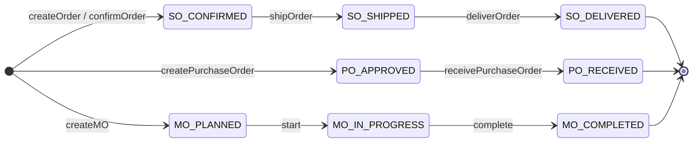

# dnPeople — Referensi Enum

**Terakhir diperbarui:** 3 Juli 2026  
**Sumber kode:** `backend/src/common/enums/`  
**API:** `GET /api/v1/enums` · `GET /api/v1/enums/:name` (public, tanpa JWT)

Dokumen ini merangkum semua enum terpusat yang dipakai di entity, DTO, dan service dnPeople. Untuk skema tabel yang memakai enum ini, lihat [`18-MODULE-FEATURES-SCHEMA.md`](18-MODULE-FEATURES-SCHEMA.md). Status proyek: [`12-PROJECT-STATUS.md`](12-PROJECT-STATUS.md).

---

## API Enum

Controller: `backend/src/common/controllers/enums.controller.ts` — terdaftar di `app.module.ts`.

| Endpoint | Deskripsi | Contoh |
|----------|-----------|--------|
| `GET /api/v1/enums` | Semua nama enum + array nilai | `{ "SalesOrderStatus": ["DRAFT", "CONFIRMED", ...] }` |
| `GET /api/v1/enums/:name` | Satu enum by name atau kebab-case | `/api/v1/enums/invoice-status` → `{ name, values }` |

**Catatan:** Endpoint `@Public()` — berguna untuk dropdown frontend dan integrasi. Enum yang belum ada di `ENUM_REGISTRY` (mis. `SubscriptionPlan`, `SakAccountType`) tidak terekspos via API ini.

---

## business.enums.ts

Enum inti modul Finance, Sales, Supply Chain, HR, Manufacturing, Projects.

### AccountType

Klasifikasi akun Chart of Accounts (CoA). Tidak ada transisi status.

| Value | Arti (ID) | Modul / Entity |
|-------|-----------|----------------|
| `ASSET` | Aset | `ChartOfAccount.accountType` |
| `LIABILITY` | Kewajiban | CoA, laporan neraca |
| `EQUITY` | Ekuitas | CoA, period close → Laba Ditahan |
| `INCOME` | Pendapatan | CoA, P&L |
| `EXPENSE` | Beban | CoA, P&L |

### JournalStatus

| Value | Arti | Next States | Trigger (kode) |
|-------|------|-------------|----------------|
| `DRAFT` | Jurnal draft | `POSTED` | Default entity; `createJournalEntry` langsung set `POSTED` |
| `POSTED` | Jurnal terposting | `REVERSED` | `GlService.reverseJournalEntry()` |
| `REVERSED` | Sudah dibalik | — | Entry asli di-mark reversed |

**File:** `gl.service.ts`, entity `journal-entry.entity.ts`

### InvoiceStatus

| Value | Arti | Next States | Trigger |
|-------|------|-------------|---------|
| `DRAFT` | Draft | `PENDING`, `APPROVED` | Create manual |
| `PENDING` | Menunggu approval/bayar | `APPROVED`, `PAID`, `OVERDUE` | Create AR/AP invoice |
| `APPROVED` | Disetujui (AP) | `PAID` | `ApService.approveInvoice`, 3-way match |
| `PAID` | Lunas | — | `recordPayment` |
| `CANCELLED` | Dibatalkan | — | Manual |
| `OVERDUE` | Jatuh tempo lewat | `PENDING`, `PAID` | Aging report / dunning |

**File:** `ar.service.ts`, `ap.service.ts`, `finance-advanced.service.ts`

### InvoiceType

| Value | Arti |
|-------|------|
| `PAYABLE` | Hutang (AP) |
| `RECEIVABLE` | Piutang (AR) |

### InvoiceDocumentKind

| Value | Arti |
|-------|------|
| `INVOICE` | Faktur standar |
| `CREDIT_MEMO` | Nota kredit |
| `DEBIT_MEMO` | Nota debit |

### SalesOrderStatus

| Value | Arti | Next States | Trigger |
|-------|------|-------------|---------|
| `DRAFT` | Draft | `CONFIRMED`, `CANCELLED` | — |
| `CONFIRMED` | Dikonfirmasi | `SHIPPED`, `DELIVERED` | `createOrder`, `confirmOrder` → queue `sales.order.confirmed` |
| `SHIPPED` | Dikirim | `DELIVERED` | `shipOrder` |
| `DELIVERED` | Terkirim | `RETURNED` | `deliverOrder` |
| `RETURNED` | Retur | — | `returnOrder` |
| `CANCELLED` | Dibatalkan | — | — |

**File:** `sales.service.ts`, entity `sales-order.entity.ts`

### StockMovementType

| Value | Arti | Efek stok |
|-------|------|-----------|
| `IN` | Masuk | `quantity += qty` |
| `OUT` | Keluar | `quantity -= qty` (validasi stok cukup) |
| `TRANSFER` | Transfer antar gudang | OUT + IN |
| `ADJUSTMENT` | Penyesuaian | `quantity += qty` |

**File:** `supply-chain.service.ts`

### EmployeeStatus

| Value | Arti | Next States |
|-------|------|-------------|
| `ACTIVE` | Aktif | `INACTIVE`, `TERMINATED` |
| `INACTIVE` | Nonaktif | `ACTIVE` |
| `TERMINATED` | Resign/PHK | — |

### LeaveStatus

| Value | Arti | Next States | Trigger |
|-------|------|-------------|---------|
| `PENDING` | Menunggu approval | `APPROVED`, `REJECTED` | `createLeaveRequest` |
| `APPROVED` | Disetujui | — | `approveLeave` |
| `REJECTED` | Ditolak | — | Reject handler |

**File:** `hr.service.ts`

### QuotationStatus

| Value | Arti | Next States |
|-------|------|-------------|
| `DRAFT` | Draft | `SENT` |
| `SENT` | Terkirim ke customer | `ACCEPTED`, `REJECTED`, `EXPIRED` |
| `ACCEPTED` | Diterima | → convert to SO |
| `REJECTED` | Ditolak | — |
| `EXPIRED` | Kadaluarsa | — |

### PurchaseOrderStatus

| Value | Arti | Next States | Trigger |
|-------|------|-------------|---------|
| `DRAFT` | Draft | `APPROVED` | — |
| `APPROVED` | Disetujui | `RECEIVED`, `CANCELLED` | `createPurchaseOrder` (default APPROVED) |
| `RECEIVED` | Barang diterima (GR) | — | `receivePurchaseOrder` → queue `procurement.po.received` |
| `CANCELLED` | Dibatalkan | — | — |

**File:** `supply-chain.service.ts`

### ManufacturingOrderStatus

| Value | Arti | Next States | Trigger |
|-------|------|-------------|---------|
| `PLANNED` | Direncanakan | `IN_PROGRESS`, `CANCELLED` | Create MO |
| `IN_PROGRESS` | Produksi berjalan | `COMPLETED`, `CANCELLED` | Start production |
| `COMPLETED` | Selesai | — | Complete → queue `manufacturing.order.completed` |
| `CANCELLED` | Dibatalkan | — | — |

**File:** `manufacturing.service.ts`

### ProjectStatus

| Value | Arti | Next States |
|-------|------|-------------|
| `PLANNING` | Perencanaan | `ACTIVE`, `CANCELLED` |
| `ACTIVE` | Berjalan | `ON_HOLD`, `COMPLETED`, `CANCELLED` |
| `ON_HOLD` | Ditunda | `ACTIVE`, `CANCELLED` |
| `COMPLETED` | Selesai | — |
| `CANCELLED` | Dibatalkan | — |

### TaskStatus

| Value | Arti | Next States |
|-------|------|-------------|
| `TODO` | Belum mulai | `IN_PROGRESS`, `BLOCKED` |
| `IN_PROGRESS` | Sedang dikerjakan | `DONE`, `BLOCKED` |
| `DONE` | Selesai | — |
| `BLOCKED` | Terhambat | `IN_PROGRESS`, `TODO` |

### PayrollStatus

| Value | Arti | Next States |
|-------|------|-------------|
| `DRAFT` | Draft payroll run | `PROCESSED` |
| `PROCESSED` | Dihitung | `PAID` |
| `PAID` | Dibayar | — |

### PeriodStatus

| Value | Arti | Next States | Trigger |
|-------|------|-------------|---------|
| `OPEN` | Periode terbuka | `CLOSED` | Default |
| `CLOSED` | Periode ditutup | — | `GlService.closePeriod()` — blok posting ke tanggal dalam periode |

**File:** `gl.service.ts`, entity `accounting-period.entity.ts`

---

## crm.enums.ts

### LeadStatus

| Value | Arti | Next States |
|-------|------|-------------|
| `NEW` | Lead baru | `QUALIFIED`, `LOST` |
| `QUALIFIED` | Tervalidasi | `CONVERTED`, `LOST` |
| `CONVERTED` | Jadi customer/opportunity | — |
| `LOST` | Hilang | — |

**Entity:** `Lead` — [`crm.entity.ts`](../backend/src/modules/crm/entities/crm.entity.ts)

### OpportunityStage

| Value | Arti | Next States |
|-------|------|-------------|
| `LEAD` | Awal pipeline | `QUALIFIED` |
| `QUALIFIED` | Qualified | `PROPOSAL` |
| `PROPOSAL` | Proposal dikirim | `NEGOTIATION` |
| `NEGOTIATION` | Negosiasi | `WON`, `LOST` |
| `WON` | Menang | → Sales Order |
| `LOST` | Kalah | — |

**Entity:** `Opportunity`

---

## enterprise.enums.ts

Modul Enterprise (procurement lanjutan, QC, valuation, custom reports).

### RequisitionStatus

| Value | Arti | Next States | Trigger |
|-------|------|-------------|---------|
| `DRAFT` | Draft PR | `SUBMITTED` | Create |
| `SUBMITTED` | Diajukan | `APPROVED`, `REJECTED` | Submit |
| `APPROVED` | Disetujui | `ORDERED` | Approve → convert to PO |
| `REJECTED` | Ditolak | — | Reject |
| `ORDERED` | Sudah jadi PO | — | `EnterpriseService.convertRequisitionToPo` |

**File:** `enterprise.service.ts`

### RfqStatus

| Value | Arti | Next States |
|-------|------|-------------|
| `DRAFT` | Draft RFQ | `SENT` |
| `SENT` | Dikirim ke vendor | `CLOSED` |
| `CLOSED` | Ditutup | — |

### ValuationMethod

Metode valuasi persediaan (konfigurasi, bukan state machine).

| Value | Arti |
|-------|------|
| `FIFO` | First In First Out |
| `LIFO` | Last In First Out |
| `AVERAGE` | Weighted average |

### WorkOrderStatus

| Value | Arti | Next States |
|-------|------|-------------|
| `PENDING` | Menunggu | `IN_PROGRESS`, `CANCELLED` |
| `IN_PROGRESS` | Berjalan | `COMPLETED`, `CANCELLED` |
| `COMPLETED` | Selesai | — |
| `CANCELLED` | Dibatalkan | — |

### QualityInspectionResult

| Value | Arti | Next States |
|-------|------|-------------|
| `PENDING` | Menunggu inspeksi | `PASS`, `FAIL` |
| `PASS` | Lulus QC | — |
| `FAIL` | Gagal QC | — |

### PerformanceReviewStatus

| Value | Arti | Next States |
|-------|------|-------------|
| `DRAFT` | Draft review | `SUBMITTED` |
| `SUBMITTED` | Diajukan | `APPROVED` |
| `APPROVED` | Disetujui HR/manager | — |

### PaymentRecordStatus

| Value | Arti | Next States |
|-------|------|-------------|
| `PENDING` | Menunggu proses | `COMPLETED`, `FAILED` |
| `COMPLETED` | Berhasil | — |
| `FAILED` | Gagal | `PENDING` (retry) |

---

## fixed-assets.enums.ts

### AssetStatus

| Value | Arti | Next States |
|-------|------|-------------|
| `ACTIVE` | Aset aktif | `UNDER_MAINTENANCE`, `DISPOSED` |
| `DISPOSED` | Dibuang/dijual | — |
| `UNDER_MAINTENANCE` | Dalam perawatan | `ACTIVE` |

**Entity:** `FixedAsset` — [`fixed-asset.entity.ts`](../backend/src/modules/fixed-assets/entities/fixed-asset.entity.ts)

### DepreciationMethod

| Value | Arti |
|-------|------|
| `STRAIGHT_LINE` | Garis lurus |
| `DECLINING_BALANCE` | Saldo menurun |

---

## hr-extended.enums.ts

### JobApplicationStatus

| Value | Arti | Next States |
|-------|------|-------------|
| `NEW` | Lamaran masuk | `SCREENING`, `REJECTED` |
| `SCREENING` | Screening CV | `INTERVIEW`, `REJECTED` |
| `INTERVIEW` | Wawancara | `OFFER`, `REJECTED` |
| `OFFER` | Tawaran kerja | `HIRED`, `REJECTED` |
| `HIRED` | Diterima | → Employee |
| `REJECTED` | Ditolak | — |

**File:** `hr.controller.ts`, entity `JobApplication`

### OvertimeStatus

| Value | Arti | Next States |
|-------|------|-------------|
| `PENDING` | Menunggu approval | `APPROVED`, `REJECTED` |
| `APPROVED` | Disetujui | — |
| `REJECTED` | Ditolak | — |

### ExpenseClaimStatus

| Value | Arti | Next States | Trigger |
|-------|------|-------------|---------|
| `PENDING` | Klaim diajukan | `APPROVED`, `REJECTED` | `createExpense` |
| `APPROVED` | Disetujui | `PAID` | `approveExpense` |
| `REJECTED` | Ditolak | — | `rejectExpense` |
| `PAID` | Sudah dibayar | — | Payment workflow |

**File:** `finance-advanced.service.ts`

---

## Diagram State — Alur Bisnis Utama



---

## Cross-Reference

| Dokumen | Isi terkait |
|---------|-------------|
| [`18-MODULE-FEATURES-SCHEMA.md`](18-MODULE-FEATURES-SCHEMA.md) | Kolom entity yang memakai enum |
| [`20-GL-INTEGRATION-EVENTS.md`](20-GL-INTEGRATION-EVENTS.md) | Event queue saat status SO/PO/MO berubah |
| [`21-BUSINESS-RULES-VALIDATION.md`](21-BUSINESS-RULES-VALIDATION.md) | Validasi transisi (credit limit, period close, dll.) |
| [`update/ENGINEERING-QUICK-ACTION-ITEMS.md`](../update/ENGINEERING-QUICK-ACTION-ITEMS.md) | Sprint P0.3 enum centralization |

**Import di kode:**

```typescript
import { SalesOrderStatus, InvoiceStatus } from '../../../common/enums/business.enums';
// atau barrel:
import { SalesOrderStatus } from '../../../common/enums';
```
