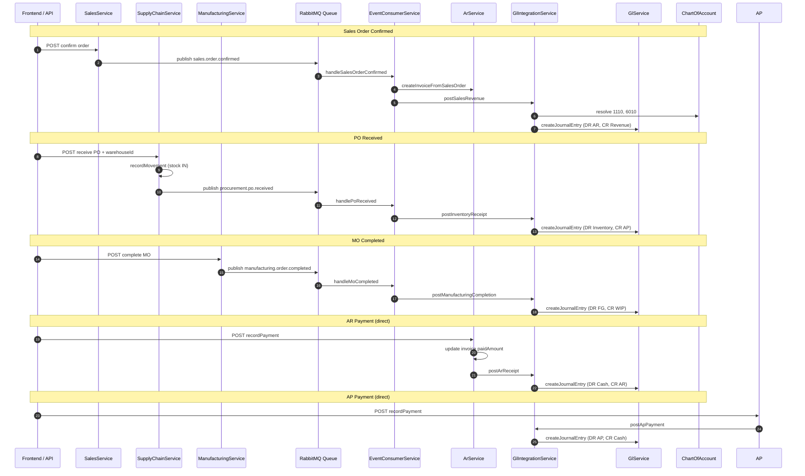

# dnPeople — GL Integration Events

**Terakhir diperbarui:** 3 Juli 2026  
**Sumber kode:**
- `backend/src/modules/finance/services/gl-integration.service.ts`
- `backend/src/infrastructure/queue/event-consumer.service.ts`
- Publisher: `sales.service.ts`, `supply-chain.service.ts`, `manufacturing.service.ts`
- Direct GL calls: `ar.service.ts`, `ap.service.ts`

Dokumen ini menjelaskan alur integrasi otomatis dari modul operasional ke General Ledger (GL). Lihat juga [`18-MODULE-FEATURES-SCHEMA.md`](18-MODULE-FEATURES-SCHEMA.md) (modul Finance) dan [`08-FINANCE-MODULE-INDONESIA.md`](08-FINANCE-MODULE-INDONESIA.md) (CoA SAK-EP).

---

## Ringkasan Arsitektur

dnPeople memakai **event-driven integration** via RabbitMQ (`QueueService`) untuk posting jurnal otomatis saat milestone bisnis tercapai. Pembayaran AR/AP memanggil `GlIntegrationService` **langsung** (bukan via queue).

| Jalur | Trigger | Handler | Method GL |
|-------|---------|---------|-----------|
| Queue | `sales.order.confirmed` | `EventConsumerService` | `postSalesRevenue` + `createInvoiceFromSalesOrder` |
| Queue | `procurement.po.received` | `EventConsumerService` | `postInventoryReceipt` |
| Queue | `manufacturing.order.completed` | `EventConsumerService` | `postManufacturingCompletion` |
| Direct | AR payment | `ArService.recordPayment` | `postArReceipt` |
| Direct | AP payment | `ApService.recordPayment` | `postApPayment` |
| Direct | SO delivered (alternatif) | `SalesService.deliverOrder` | `postSalesRevenue` (duplikat path dengan confirm) |

**Catatan:** Saat `confirmOrder`, consumer membuat invoice AR **dan** posting revenue. Saat `deliverOrder`, `postSalesRevenue` dipanggil lagi — pastikan idempotency di production (lihat [`update/ENGINEERING-PRIORITY-FIXES-ACTION-PLAN.md`](../update/ENGINEERING-PRIORITY-FIXES-ACTION-PLAN.md)).

---

## Queue Events

### 1. `sales.order.confirmed`

**Publisher:** `SalesService.confirmOrder()` — `backend/src/modules/sales/sales.service.ts`

```typescript
await this.queue.publish('sales.order.confirmed', { tenantId, orderId: saved.id });
```

**Payload:**

| Field | Type | Wajib |
|-------|------|-------|
| `tenantId` | string | ✅ |
| `orderId` | string | ✅ |

**Consumer handler:** `EventConsumerService.handleSalesOrderConfirmed()`

1. `ArService.createInvoiceFromSalesOrder(tenantId, orderId)` — buat invoice AR (PPN 11%)
2. `GlIntegrationService.postSalesRevenue(tenantId, orderId)` — jurnal revenue

**Jurnal yang dihasilkan:**

| Akun (primary / fallback) | Debit | Credit | Keterangan |
|---------------------------|-------|--------|------------|
| `1110` Piutang Usaha / `1100` | `order.totalAmount` | — | AR |
| `6010` Penjualan Produk / `4000` | — | `order.totalAmount` | Revenue |

---

### 2. `procurement.po.received`

**Publisher:** `SupplyChainService.receivePurchaseOrder()` — setelah goods receipt + stock IN

```typescript
await this.queue.publish('procurement.po.received', { tenantId, poId: saved.id });
```

**Payload:** `{ tenantId, poId }`

**Consumer:** `GlIntegrationService.postInventoryReceipt(tenantId, poId)`

**Jurnal:**

| Akun (primary / fallback) | Debit | Credit |
|---------------------------|-------|--------|
| `1210` Bahan Baku / `1200` | Σ(qty × unitPrice) per line | — |
| `3010` Utang Usaha / `2000` | — | Σ(qty × unitPrice) |

Amount dihitung dari `po.lines`, bukan `po.totalAmount`.

---

### 3. `manufacturing.order.completed`

**Publisher:** `ManufacturingService` saat MO complete

```typescript
await this.queue.publish('manufacturing.order.completed', { tenantId, orderId: id });
```

**Payload:** `{ tenantId, orderId }`

**Consumer:** `GlIntegrationService.postManufacturingCompletion(tenantId, orderId)`

**Jurnal:**

| Akun (primary / fallback) | Debit | Credit |
|---------------------------|-------|--------|
| `1230` Barang Jadi / `1200` | `producedQuantity × 100` | — |
| `8010` Bahan Baku Dipakai / `5000` | — | `producedQuantity × 100` |

> **Implementasi saat ini:** Biaya per unit hardcoded `100` — placeholder untuk costing penuh (BOM × actual cost).

---

## Direct GL Calls (Non-Queue)

### `postArReceipt` — Penerimaan piutang

**Dipanggil dari:** `ArService.recordPayment()` setelah update `paidAmount` / status invoice.

| Akun | Debit | Credit |
|------|-------|--------|
| `1010` Kas / `1000` | `amount` | — |
| `1110` Piutang / `1100` | — | `amount` |

**Validasi upstream:** Payment tidak boleh melebihi outstanding balance.

---

### `postApPayment` — Pembayaran hutang

**Dipanggil dari:** `ApService.recordPayment()` setelah invoice AP approved/pending.

| Akun | Debit | Credit |
|------|-------|--------|
| `3010` Utang Usaha / `2000` | `amount` | — |
| `1010` Kas / `1000` | — | `amount` |

---

## Resolusi Akun COA

Method private `accountId(tenantId, code, fallback?)` di `GlIntegrationService`:

1. Cari akun by `tenantId` + `code` exact
2. Jika tidak ada, coba `fallback`
3. Jika masih tidak ada → throw `GL account {code} not found`

CoA default di-seed saat register tenant via `GlService.seedDefaultAccounts()` dari `INDONESIA_COA` — lihat [`indonesia-coa.ts`](../backend/src/modules/finance/data/indonesia-coa.ts).

### Tabel Mapping Lengkap

| Event / Method | Debit Account | Credit Account | Reference |
|----------------|---------------|----------------|-----------|
| Sales revenue | 1110 (AR) | 6010 (Revenue) | `order.orderNumber` |
| PO receipt | 1210 (Inventory) | 3010 (AP accrual) | `po.poNumber` |
| MO completion | 1230 (Finished goods) | 8010 (COGS/WIP) | `mo.orderNumber` |
| AR receipt | 1010 (Cash) | 1110 (AR) | `invoiceNumber` |
| AP payment | 3010 (AP) | 1010 (Cash) | `invoiceNumber` |

Semua jurnal melalui `GlService.createJournalEntry()` yang menegakkan **debit = credit** (toleransi ±0.01) dan **period open** check.

---

## Sequence Diagram



---

## Event Lain (Belum GL Consumer)

Event berikut dipublish tapi **belum** punya handler di `EventConsumerService`:

| Event | Publisher |
|-------|-----------|
| `sales.quotation.created` | `SalesService.createQuotation` |
| `sales.order.shipped` | `SalesService.shipOrder` |
| `sales.order.delivered` | `SalesService.deliverOrder` |
| `sales.order.returned` | `SalesService.returnOrder` |
| `procurement.po.created` | `SupplyChainService.createPurchaseOrder` |
| `manufacturing.order.created` | `ManufacturingService` |
| `webhook.dispatch` | `IntegrationsService` |

---

## Error Handling

Consumer handlers wrap try/catch — error di-log, **tidak re-throw** (fire-and-forget). Implikasi:

- GL posting gagal → order tetap confirmed/received tanpa jurnal
- Perlu monitoring log `EventConsumerService` + dead-letter queue di production

**Tests:** `gl-integration.service.spec.ts`, `event-consumer.service.spec.ts`

---

## Cross-Reference

| Dokumen | Isi |
|---------|-----|
| [`19-ENUMS-REFERENCE.md`](19-ENUMS-REFERENCE.md) | Status SO/PO/MO |
| [`21-BUSINESS-RULES-VALIDATION.md`](21-BUSINESS-RULES-VALIDATION.md) | Validasi jurnal balanced, period close |
| [`12-PROJECT-STATUS.md`](12-PROJECT-STATUS.md) | Fase 1 — GL integration event-driven |
| [`update/ENGINEERING-QUICK-ACTION-ITEMS.md`](../update/ENGINEERING-QUICK-ACTION-ITEMS.md) | P0.4 GL docs & tests |
