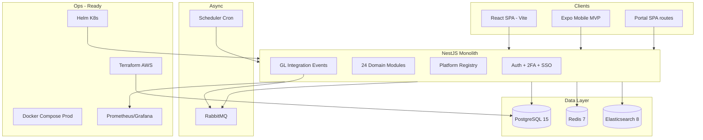

# PRD Baseline — Current State & Tech Stack
## dnPeople ERP · Acuan untuk PRD Berikutnya

**Document ID:** Doc 25  
**Version:** 1.0  
**Date:** 7 July 2026  
**Owner:** PT. Dozer Napitupulu Technology · [dntech.id](https://dntech.id)  
**Repository:** [github.com/dreamcraft17/erp](https://github.com/dreamcraft17/erp)  
**Branch:** `main` · Latest commits: `e2f46fc` (production hardening) · `a48da49` (docs sync)

> **Tujuan dokumen ini:** Snapshot kondisi produk **saat ini** — stack, arsitektur, modul, metrik, gap, dan rekomendasi — agar tim product/engineering bisa menulis **PRD v2 / Phase 5+** tanpa mengulang discovery dari nol.  
> **Bukan PRD baru** — melainkan baseline factual dari codebase live.

**Dokumen terkait:**
- [`01-PRD-ERP-System.md`](01-PRD-ERP-System.md) — PRD original (vision & roadmap 4 fase)
- [`12-PROJECT-STATUS.md`](12-PROJECT-STATUS.md) — status operasional terkini
- [`17-REMAINING-SRS-GAPS.md`](17-REMAINING-SRS-GAPS.md) — gap detail per requirement SRS
- [`18-MODULE-FEATURES-SCHEMA.md`](18-MODULE-FEATURES-SCHEMA.md) — schema DB & API per modul

---

## 1. Product Identity

| Field | Value |
|-------|-------|
| **Product name** | dnPeople |
| **Legal owner** | PT. Dozer Napitupulu Technology (dntech.id) |
| **Category** | Multi-tenant SaaS ERP |
| **Primary market** | Indonesia SMEs → mid-market (SAK-EP, PPh 21, e-Faktur) |
| **Deployment model** | Cloud (AWS target) · Docker/K8s · modular monolith |
| **Tenant model** | Row-level `tenantId` · optional schema-per-tenant (`TENANT_SCHEMA_MODE=schema`) |
| **Auth model** | Email + password · JWT access/refresh · 2FA TOTP · Google SSO · Portal JWT terpisah |

---

## 2. Completion Summary (Jul 2026)

| Dimensi | Target (PRD/SRS) | Actual | % |
|---------|------------------|--------|---|
| PRD Phase 1–4 (coding) | 4 phases | **All shipped** | **100%** code |
| SRS functional requirements | 150+ | ~140+ implemented | **~95%** |
| Backend domain modules | 15+ | **24** + platform | **100%** structure |
| Frontend SPA pages | 20+ | **29** | **100%** |
| Unit test coverage | 60%+ gate | **≥60%** · 390 tests | ✅ |
| Production infra templates | AWS/K8s | Ready · not live | **~80%** |
| Mobile native | iOS/Android | Expo MVP | **~30%** |
| i18n | 15+ languages | 15 locales (2 full) | **~70%** |

**Kesimpulan untuk PRD berikutnya:** Jangan re-scope modul core ERP — fokus ke **go-live**, **depth/quality**, **mobile native**, **AI/analytics advanced**, dan **enterprise tier-2** (LMS, OCR, full microservices).

---

## 3. Phase Delivery History

| Phase | PRD focus | Shipped | Key deliverables |
|-------|-----------|---------|------------------|
| **0** | MVP scaffold | ✅ | NestJS monolith, 16 modul, Docker, Docs 00–06 |
| **1** | Tier-1 enterprise | ✅ | Custom reports, workflow engine, integrations gallery, portal JWT |
| **2** | Enhanced features | ✅ | Dashboard builder, KPI alerts, OLAP UI, documents, workflow SLA |
| **3** | Scale & optimize | ✅ | Analytics, e-sign, HR 360°, Expo mobile, platform registry, JIRA/shipping |
| **4** | Market expansion | ✅ | 15 locales, industry templates, prod Docker/Helm/Terraform, smoke scripts |

---

## 4. Technology Stack (Actual)

### 4.1 Runtime & Languages

| Layer | Technology | Version (approx.) |
|-------|------------|-------------------|
| Runtime | Node.js | **20 LTS** |
| Language | TypeScript | **5.x** (backend ~5.1, frontend ~6.0) |
| Package manager | npm | lockfiles per package |

### 4.2 Backend

| Component | Technology |
|-----------|------------|
| Framework | **NestJS 10** |
| ORM | **TypeORM 0.3** |
| Database | **PostgreSQL 15** (dev: Docker · prod: RDS target · demo: `DB_MODE=memory` pg-mem) |
| Auth | JWT (`@nestjs/jwt`) · Passport · bcrypt · TOTP (`otplib`) |
| Validation | `class-validator` · `class-transformer` |
| API docs | Swagger (`@nestjs/swagger`) — disabled in `NODE_ENV=production` |
| Scheduling | `@nestjs/schedule` (cron) |
| Events | `@nestjs/event-emitter` + RabbitMQ consumers |
| Queue | **RabbitMQ 3.12** · Bull (optional) |
| Cache | **Redis 7** · `@nestjs/cache-manager` |
| Search | **Elasticsearch 8.11** (graceful fallback if down) |
| Email | **Nodemailer** (SMTP or console fallback) |
| Export | **ExcelJS** · **PDFKit** |
| Metrics | **prom-client** → `/api/v1/metrics` (Prometheus text) |
| Security | **Helmet** · compression · throttling (`@nestjs/throttler`) · audit interceptor |
| Testing | **Jest 29** · supertest · pg-mem |

**API convention:** REST · prefix `/api/v1` · response wrapper `{ success, data, timestamp }` (kecuali metrics/health)

### 4.3 Frontend (Web SPA)

| Component | Technology |
|-----------|------------|
| Framework | **React 19** |
| Build | **Vite 8** |
| State | **Redux Toolkit 2** |
| UI | **MUI 9** · **Tailwind CSS 4** |
| Routing | **React Router 7** |
| Forms | **react-hook-form** · **Zod 4** |
| Charts | **Recharts 3** |
| HTTP | **Axios** (auto token refresh) |
| i18n | Custom context · **15 locales** · default **ID** |
| E2E | **Cypress 15** (15 spec files) |

### 4.4 Mobile

| Component | Technology |
|-----------|------------|
| Framework | **React Native / Expo ~52** |
| Navigation | React Navigation 7 |
| Storage | expo-secure-store (JWT) |
| Build | EAS (`eas.json` — staging + production profiles) |
| Scope | Login + dashboard MVP only |

### 4.5 Infrastructure & DevOps

| Component | Technology / Path |
|-----------|-------------------|
| Container | Docker · `docker-compose.yml` (dev) · `docker-compose.prod.yml` (prod) |
| Orchestration | Kubernetes manifests · **Helm** (`k8s/helm/`) |
| Cloud IaC | **Terraform** — VPC, RDS PostgreSQL 15, ElastiCache Redis (`terraform/`) |
| CI | GitHub Actions — `.github/workflows/ci.yml` |
| CD | `deploy-staging.yml` · `deploy-production.yml` (post-deploy smoke) |
| Monitoring | Prometheus + Grafana (Docker Compose) |
| Scripts | `production-smoke.sh` · `db-backup.sh` · `production-checklist.sh` · k6 load test |

### 4.6 SDD Target vs Actual

| Aspek | SDD (Doc 03) target | Implementasi actual |
|-------|---------------------|---------------------|
| Backend framework | Express.js | **NestJS 10** modular monolith |
| Services | 12 microservices | **24 modules** in-process + registry scaffold |
| Multi-tenant | Schema-per-tenant | Row-level `tenantId` + optional schema hook |
| Mobile | Native iOS/Android full | **Expo MVP** |
| Deploy | 12 K8s services | Single API + frontend · Helm ready |

---

## 5. Module Inventory (Backend)

Path base: `backend/src/modules/` · Platform: `backend/src/platform/`

| # | Module | API prefix (typical) | Maturity | Highlights |
|---|--------|-------------------|----------|------------|
| 1 | auth | `/auth` | Production | JWT, 2FA, SSO Google, throttling, refresh |
| 2 | tenants | `/tenants` | Production | Provisioning, plan, quota |
| 3 | finance | `/finance` | Production | GL, AP/AR, SAK-EP, e-Faktur, dunning, intercompany |
| 4 | sales | `/sales` | Production | SO, quotation, credit limit, confirm→AR |
| 5 | supply-chain | `/supply-chain` | Production | PO, GR, MRP, barcode, transfer |
| 6 | hr | `/hr` | Production | Payroll PPh 21, leave, ATS, **360° feedback** |
| 7 | manufacturing | `/manufacturing` | Production | BOM version, MO, scrap, capacity |
| 8 | projects | `/projects` | Production | Tasks, billable time, budget, deps |
| 9 | crm | `/crm` | Production | Leads, opportunities, pipeline |
| 10 | fixed-assets | `/fixed-assets` | Production | Register, depreciation |
| 11 | enterprise | `/enterprise` | Production | RFQ, PR, cycle count, QC, work orders |
| 12 | reporting | `/reporting`, `/reports` | Production | Custom reports, dashboard builder, KPI, OLAP |
| 13 | workflow | `/workflow` | Production | Engine, inbox, SLA dashboard, escalation |
| 14 | analytics | `/analytics` | MVP | Forecast, churn, anomalies |
| 15 | documents | `/documents` | MVP | Upload, e-sign requests |
| 16 | integrations | `/integrations` | MVP+ | Stripe, Slack, Zapier, Shopify, JIRA, shipping |
| 17 | portal | `/portal` | Production | JWT portal, payments, tickets, vendor upload |
| 18 | industry | `/industry` | MVP | 5 vertical templates (Phase 4) |
| 19 | billing | `/billing` | Production | Stripe checkout, plan limits |
| 20 | users | `/users` | Production | Admin, plan enforcement |
| 21 | notifications | `/notifications` | Production | In-app |
| 22 | gdpr | `/gdpr` | Production | Export, erasure |
| 23 | scheduler | — (cron) | Production | Dunning, reports, KPI alerts |
| 24 | health | `/health` | Production | Live + ready probes (DB, Redis) |
| — | platform | `/platform` | Scaffold | Microservice registry |

**Cross-cutting:** `backend/src/common/` (guards, audit, tenant schema interceptor, enums API, export) · `backend/src/infrastructure/` (email, queue, search, metrics)

---

## 6. Frontend Inventory (Web)

Path: `frontend/src/pages/` — **29 pages**

| Group | Routes | Count |
|-------|--------|-------|
| Core ERP | `/`, `/finance/*`, `/sales/*`, `/inventory/*`, `/hr/*`, `/manufacturing/*`, `/projects/*`, `/crm/*`, `/fixed-assets/*` | 9 areas |
| Reporting & BI | `/reports/*`, `/report-builder`, `/dashboard-builder`, `/analytics` | 4 |
| Automation | `/workflows`, `/integrations`, `/documents` | 3 |
| Admin | `/settings/*`, `/notifications` | 5 |
| Auth | `/login`, `/register`, `/verify-email`, `/forgot-password`, `/reset-password` | 5 |
| Portal | `/portal`, `/portal/login` (+ forgot/reset) | 3 |

**Shared components:** `CrudTable`, `FormDialog`, `Layout`, `LocaleSelector`, `AppLogo`  
**i18n keys:** ~269 (EN + ID full) · 13 locales EN fallback

---

## 7. Database & Migrations

| Item | Detail |
|------|--------|
| Engine | PostgreSQL 15 |
| ORM sync | `synchronize=false` in production |
| Migrations | TypeORM · `backend/src/database/migrations/` |
| Count | **14 files** (`0000` Baseline → `0013` Phase 3) |
| Key migrations | `0005` reports · `0006` workflow · `0007` integrations · `0008` portal · `0012` dashboard/docs · `0013` analytics/e-sign/HR360 |
| Seed | `npm run db:seed` — tenant `demo-company` |
| Indexing | Doc 22 + migration `0003` + entity `@Index` |

---

## 8. Integrations Matrix

| Provider | Backend | Live keys | Notes |
|----------|---------|-----------|-------|
| Stripe | ✅ checkout + OAuth stub | 🟡 | Dev fallback to local plan upgrade |
| Slack | ✅ notifications/approvals | 🟡 | Webhook + OAuth stub |
| Zapier | ✅ hooks | 🟡 | |
| Shopify | ✅ connector | 🟡 | |
| JIRA | ✅ connector | 🟡 | Phase 3 |
| JNE / Shipping | ✅ connector | 🟡 | Phase 3 |
| Google SSO | ✅ id_token login | ✅ | |
| Elasticsearch | ✅ search index | ✅ local | Graceful fallback |
| RabbitMQ | ✅ GL events | ✅ local | Graceful fallback |

---

## 9. Security & Compliance (Implemented)

| Control | Status |
|---------|--------|
| JWT access + refresh | ✅ |
| 2FA TOTP + backup codes | ✅ |
| Login throttling (5×/15m) | ✅ |
| RBAC + tenant guard | ✅ |
| Audit log interceptor | ✅ |
| Field encryption util (AES-256) | ✅ |
| GDPR export / erasure | ✅ |
| Helmet + CORS + rate limit | ✅ |
| Env validation on boot | ✅ |
| SOC 2 | 📋 Doc 24 scaffold — no live audit |
| e-Faktur / NPWP (Indonesia) | ✅ |

---

## 10. Quality & Testing

| Type | Tool | Count / Gate |
|------|------|--------------|
| Unit tests | Jest | **390 tests** · **83 suites** |
| Coverage gate | CI | **≥60%** statements/lines |
| E2E | Cypress | **15** spec files |
| Load test | k6 | `scripts/load-test/k6-smoke.js` |
| Smoke (prod) | bash | `scripts/production-smoke.sh` |
| Checklist | bash | `scripts/production-checklist.sh` |

---

## 11. Localization (Phase 4)

| Locale | Code | Translation depth |
|--------|------|-------------------|
| Indonesian | `id` | **Full** (default) |
| English | `en` | **Full** |
| Malay, Thai, Vietnamese, Chinese, Japanese, Korean, Hindi, Arabic, Spanish, Portuguese, French, German, Dutch | `ms`…`nl` | UI shell · **EN fallback** for keys |

Registry: `frontend/src/i18n/supportedLocales.ts` · Selector: `LocaleSelector` component · RTL: Arabic

---

## 12. Industry Templates (Phase 4)

API: `GET /api/v1/industry/templates`

| ID | Vertical | Modules preset |
|----|----------|----------------|
| `retail` | Retail & Distribution | sales, supply-chain, finance, crm |
| `manufacturing` | Manufacturing | manufacturing, supply-chain, finance, projects |
| `services` | Professional Services | projects, crm, finance, hr |
| `hospitality` | Hospitality & F&B | supply-chain, hr, finance, fixed-assets |
| `healthcare` | Healthcare Clinics | finance, hr, documents, crm |

---

## 13. Demo & Local Dev

```bash
npm run infra:up
cd backend && npm run db:migrate && npm run db:seed && npm run start:dev
cd frontend && npm run dev
```

| Role | Email | Password |
|------|-------|----------|
| Admin | `admin@demo.com` | `Demo1234!` |
| Portal customer | `customer@demo.com` | `Demo1234!` |
| Portal vendor | `vendor@demo.com` | `Demo1234!` |

| URL | Path |
|-----|------|
| Web app | http://localhost:5173 |
| API | http://localhost:3000/api/v1 |
| Swagger | http://localhost:3000/api/docs |
| Metrics | http://localhost:3000/api/v1/metrics |

---

## 14. Known Gaps (Input untuk PRD Berikutnya)

### 14.1 Ops — blocking live (bukan feature coding)

- AWS credentials → `terraform apply` → EKS/RDS live
- Production secrets: Stripe, Slack, SMTP, JIRA, JNE
- RDS migration validation on live (`0005`–`0013`)
- App Store / Play Store submission (EAS ready)

### 14.2 Partial / scaffold (perlu PRD depth)

| Area | Current | PRD next likely ask |
|------|---------|---------------------|
| Microservices | Registry scaffold, monolith | Split bounded contexts? |
| Tenant isolation | Row-level + hook | Full schema-per-tenant migration |
| Mobile | Expo MVP 2 screens | Full module parity, offline, push, biometric |
| Analytics | Rule-based forecast/churn | ML models, what-if, scenario planning |
| Documents | Upload + e-sign stub | OCR, archive, DocuSign-level workflow |
| i18n | 2 full + 13 fallback | Professional translation all 15+ |
| Integrations | Stubs + gallery | Live OAuth, webhook replay, partner SDK |
| HR | 360° feedback MVP | LMS, succession, talent planning |
| Workflow | SLA + reorder | Visual drag-drop designer (BPMN) |
| SSO | Google only | Azure AD, SAML, Okta |

### 14.3 Explicitly out of current scope

- SOC 2 Type II certification (process + audit)
- ELK/Sentry production pipeline
- AI copilot / natural language queries
- Multi-region active-active
- White-label / reseller portal

---

## 15. Recommended Themes for PRD v2 (Phase 5+)

Gunakan baseline ini untuk memilih **1–3 tema** — jangan scope ulang core ERP.

| Theme | Rationale | Effort (rough) |
|-------|-----------|----------------|
| **A. Go-Live & SRE** | Code 100% ready; revenue blocked by deploy | 1–2 weeks + credentials |
| **B. Mobile Native GA** | Competitor parity (Mekari mobile) | 6–8 weeks |
| **C. AI & Advanced BI** | Differentiation post-MVP | 8–12 weeks |
| **D. Enterprise Tier-2** | OCR, LMS, Azure SSO, full consolidation | 12–16 weeks |
| **E. Platform / ISV** | Partner API, marketplace revenue share | 8–10 weeks |
| **F. i18n & SEA expansion** | Full TH/VI/ZH translations + compliance | 4–6 weeks |

---

## 16. Architecture Diagram (Current)



---

## 17. Document Map for PRD Authors

| Need | Read |
|------|------|
| Original vision & 4-phase roadmap | Doc 01 PRD |
| Requirement-level detail | Doc 02 SRS |
| Target architecture (long-term) | Doc 03 SDD |
| Finance Indonesia rules | Doc 08 |
| Reporting SAK-EP | Doc 10 |
| Live status snapshot | Doc 12 |
| Gap per SRS item | Doc 17 |
| DB schema & API per module | Doc 18 |
| Deploy runbook | Doc 15 |
| Executive metrics | `update/CEO-TRACKING-SHEET.md` |
| Competitor gap (Mekari/SAP) | `update/GAPS-VS-MEKARI-SAP-ROADMAP.md` |
| **This baseline** | **Doc 25 (this file)** |

---

## 18. Changelog

| Version | Date | Changes |
|---------|------|---------|
| 1.0 | 7 Jul 2026 | Initial baseline post Phase 1–4 + production hardening |

---

*Maintainer: Update this document at each major release or before drafting PRD v2.*  
*Owned by: dntech.id — PT. Dozer Napitupulu Technology*
