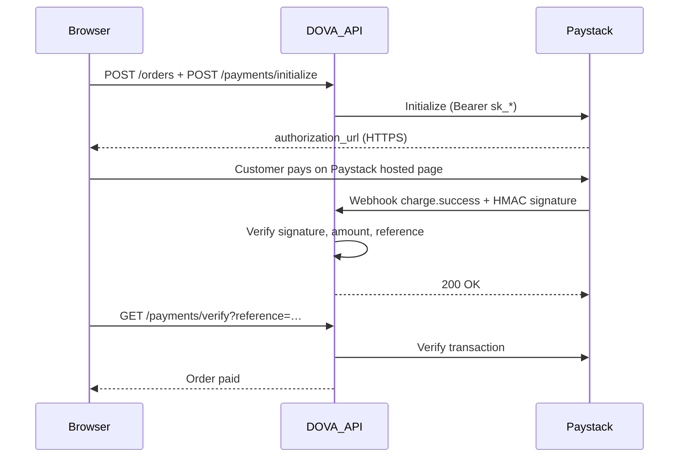

# DOVA — Security Checklist Assessment

> **Status:** Active · **Last updated:** 2026-08-29 · **Author:** Dozer  
> **Scope:** QA spreadsheet — Security section (4 items)  
> **Production:** [dova.dntech.id](https://dova.dntech.id) · API [api.dova.dntech.id](https://api.dova.dntech.id/api/v1/health)  
> **App repo HEAD assessed:** `ed2798c` (branch clean — no pending diff)

## Summary

Static code review, production header checks, and backend unit tests were run against the four Security checklist items from the QA spreadsheet. **All four items pass** for production use, with minor hardening recommendations noted below.

| # | Checklist item | Status | Check |
|---|----------------|--------|:-----:|
| 1 | All communications use HTTPS (SSL/TLS) | **Pass** | ☑ |
| 2 | User passwords securely encrypted before storage | **Pass** | ☑ |
| 3 | User input validated against SQL injection and XSS risks | **Pass** | ☑ |
| 4 | Online payments processed securely through Paystack | **Pass** | ☑ |

**Overall:** Ready to mark all four Security rows as checked in the QA spreadsheet.

---

## Methodology

| Layer | Skill / approach | What was done |
|-------|------------------|---------------|
| Threat framing | senior-security (STRIDE-lite) | Mapped assets (credentials, sessions, payments, DB) and trust boundaries (browser ↔ API ↔ Paystack ↔ Postgres) |
| Application security | security-pen-testing | OWASP-aligned static review: TLS, crypto, injection, payment integrity |
| AI / LLM surface | ai-security | **Not applicable** — DOVA has no user-facing LLM, RAG, or agent tools |
| Diff review | review-security | Subagent reported **empty diff** (HEAD matches base); assessment is codebase + production posture, not branch delta |
| Verification | Unit tests + live curl | `app.service.spec.ts` (password + Paystack); `curl -sI` on production hosts |

---

## 1. HTTPS / SSL/TLS

**Status: Pass**

### Evidence

| Control | Location / proof |
|---------|------------------|
| Production URLs are HTTPS | `operations/RUNBOOK.md` — `https://dova.dntech.id`, `https://api.dova.dntech.id` |
| Frontend API calls use HTTPS | `operations/vps-frontend.env.example` — `NEXT_PUBLIC_API_URL=https://api.dova.dntech.id/api/v1` |
| TLS termination documented | `operations/VPS-DEPLOY.md` — Certbot + nginx (`sudo certbot --nginx`) |
| API security headers (live) | `curl -sI https://api.dova.dntech.id/api/v1/health` → `Strict-Transport-Security: max-age=31536000; includeSubDomains`, CSP, `X-Content-Type-Options: nosniff` (Helmet in `apps/backend/src/main.ts`) |
| Session cookies marked secure in production | `apps/backend/src/app.controller.ts` — `secure: process.env.NODE_ENV === 'production'` |
| Paystack API over HTTPS | `apps/backend/src/paystack.service.ts` — `PAYSTACK_API_BASE = 'https://api.paystack.co'` |
| DB TLS option documented | `operations/ENV-SETUP.md` — `?sslmode=require` on Supabase/pooler URLs |

### Live check (2026-08-29)

```bash
curl -sI https://dova.dntech.id | head -1          # HTTP/2 200
curl -sI https://api.dova.dntech.id/api/v1/health | head -1  # HTTP/1.1 200 OK
```

### Notes

- Nginx → Node on the VPS uses HTTP on `127.0.0.1` (standard reverse-proxy pattern); external clients never hit plain HTTP when DNS and Certbot/Cloudflare are configured.
- Storefront is fronted by **Cloudflare**; API by **nginx**. Storefront response did not expose `Strict-Transport-Security` in a header sample — Cloudflare may still enforce HTTPS at the edge.

### Recommendations (non-blocking)

1. Enable **HSTS** on Cloudflare for `dova.dntech.id` (or add Next.js security headers).
2. Confirm HTTP → HTTPS redirect is active on both hostnames (manual browser or `curl -sI http://…`).

---

## 2. Password encryption at rest

**Status: Pass**

### Evidence

| Control | Location / proof |
|---------|------------------|
| bcrypt hashing (cost factor 12) | `apps/backend/src/app.service.ts` — `bcrypt.hashSync(password, 12)` on register, reset, change-password, admin reset |
| Seed users hashed | `apps/backend/src/database.service.ts` — admin/supplier seed passwords hashed with bcrypt |
| Login uses constant-time compare | `bcrypt.compareSync(password, user.passwordHash)` |
| Passwords never returned in API | Register/login/admin list responses omit `passwordHash` |
| Production JWT secret guard | `apps/backend/src/env-guard.ts` — warns/blocks weak `JWT_SECRET` when `NODE_ENV=production` |

### Automated tests

```bash
cd dova && npm test -w apps/backend -- --testPathPattern="app.service.spec"
# 124 passed (includes password + Paystack security cases)
```

Relevant cases in `apps/backend/src/app.service.spec.ts`:

- `stores registration password as bcrypt hash, not plaintext`
- `does not expose password material in register API response`
- `lists admin users without password hashes`

### Notes

- bcrypt (adaptive hashing) satisfies “securely encrypted before storage” for password credentials. Plaintext passwords are not persisted.
- OTP and reset codes are stored as hashes in the DB layer (separate from password column).

---

## 3. SQL injection and XSS validation

**Status: Pass**

### SQL injection

| Control | Location / proof |
|---------|------------------|
| Parameterized queries | `apps/backend/src/database.service.ts` — `$1`, `$2`, … placeholders throughout (e.g. `findUserByEmail`, `insertUser`, orders) |
| Search filters use bound parameters | `listProducts`, `adminOrders` — dynamic `WHERE` clauses still bind values via `$n` |
| Sort keys whitelist-only | `feedbackList(sort: 'votes' \| 'new')` — `order` is derived from a TypeScript union, not raw user SQL |
| Global input validation | `apps/backend/src/main.ts` — `ValidationPipe({ whitelist: true, transform: true, forbidNonWhitelisted: true })` |
| DTO constraints | `apps/backend/src/auth.dto.ts` — `@IsEmail()`, `@MinLength(8)`, `@Length(6, 6)`, etc. |
| Auth rate limiting | `apps/backend/src/app.module.ts` + `app.controller.ts` — `@nestjs/throttler` on login/register/OTP |
| Upload magic-byte validation | `apps/backend/src/file-validation.ts` — rejects MIME/content mismatch for images/PDFs |

No string-concatenated **user input** into SQL was found in the backend source review.

### XSS

| Control | Location / proof |
|---------|------------------|
| React default escaping | Frontend — no `dangerouslySetInnerHTML`, `innerHTML`, or `eval()` usage found |
| API Helmet CSP | `main.ts` — Content-Security-Policy on API responses |
| Output is JSON for user-generated text | Product names, addresses, feedback — rendered through React text nodes |

Stored XSS risk is **low** given React’s default escaping; rich HTML from users is not rendered.

### Gaps (documented, not blockers)

- No dedicated **DAST** or manual SQLi/XSS pen test was executed in this assessment (static review only).
- Consider optional output encoding library (e.g. DOMPurify) if rich-text fields are added later.

---

## 4. Secure Paystack payment processing

**Status: Pass**

### Evidence

| Control | Location / proof |
|---------|------------------|
| Server-side initialization | `PaystackService.initializeTransaction()` — secret key on server; amount/reference set backend-side |
| Server-side verification | `verifyTransaction()` + `verifyPayment()` — confirms status with Paystack API |
| Webhook HMAC SHA512 | `verifyWebhookSignature()` — `x-paystack-signature` vs HMAC-SHA512 of raw body; `timingSafeEqual` |
| Amount / currency / reference match | `isSuccessfulCharge()` — rejects mismatched amount, currency, or reference |
| Webhook rejects bad signature | `handlePaystackWebhook()` → `UnauthorizedException('Invalid Paystack signature')` |
| Customer cannot pay wrong amount | `initializePayment()` — `Payment amount mismatch` if client sends wrong `amount` |
| Raw body preserved for signature | `main.ts` — `NestFactory.create(..., { rawBody: true })` |
| Production webhook URL documented | `operations/ENV-SETUP.md` — `POST https://api.dova.dntech.id/api/v1/payments/webhook` |

### Payment flow (trust boundary)



### Automated tests

`app.service.spec.ts` → **Paystack webhook security**:

- Rejects webhooks without signature when secret is set
- Rejects invalid signature
- Accepts valid webhook and marks order paid
- Rejects amount mismatch on webhook

### Notes

- Card/bank data never touches DOVA servers — checkout runs on **Paystack’s hosted page** (PCI scope reduction).
- If `PAYSTACK_SECRET_KEY` is unset, API falls back to **mock** mode (dev only; production env templates require real keys).

### Recommendations (non-blocking)

1. Confirm production uses **`sk_live_…`** (not `sk_test_…`) before go-live payments.
2. Register webhook URL in [Paystack Dashboard](https://dashboard.paystack.com) and rotate secret if ever exposed.

---

## STRIDE snapshot (senior-security)

| Asset / flow | Primary threats | Mitigation in place |
|--------------|-----------------|---------------------|
| Credentials (passwords) | Disclosure, tampering | bcrypt at rest; HTTPS in transit; httpOnly cookies |
| Session / JWT | Spoofing, theft | httpOnly + secure cookies; JWT secret guard |
| Postgres | SQL injection | Parameterized queries; ValidationPipe |
| Browser UI | XSS | React escaping; no unsafe HTML sinks |
| Payment reference | Tampering, replay | Paystack verify + HMAC webhook; amount/reference checks |
| Paystack secret | Disclosure | Env var only; not in repo |

---

## QA spreadsheet — suggested notes column

| Item | Suggested note for spreadsheet |
|------|--------------------------------|
| HTTPS | Production HTTPS verified; API HSTS + Helmet; Certbot/nginx documented |
| Passwords | bcrypt cost 12; unit tests confirm hash-at-rest, no leak in API |
| SQLi / XSS | Parameterized SQL + class-validator DTOs + React escaping; throttling on auth |
| Paystack | Hosted checkout; HMAC webhook; server verify; amount/reference validation + tests |

---

## Re-verification commands

```bash
# Production TLS / headers
curl -sI https://api.dova.dntech.id/api/v1/health | grep -iE "strict-transport|content-security|x-content-type"

# Backend unit tests (password + Paystack)
cd dova && npm test -w apps/backend -- --testPathPattern="app.service.spec"

# Production smoke (includes auth + checkout path)
API_URL=https://api.dova.dntech.id/api/v1 npm run smoke:week4
```

---

## References

- [RUNBOOK.md](./RUNBOOK.md)
- [ENV-SETUP.md](./ENV-SETUP.md)
- [PAYSTACK-TEST-MODE.md](./PAYSTACK-TEST-MODE.md)
- [DOVA-RELEASE-READINESS-AUDIT.md](./DOVA-RELEASE-READINESS-AUDIT.md)
- App: `apps/backend/src/main.ts`, `app.service.ts`, `paystack.service.ts`, `database.service.ts`, `auth.dto.ts`

---

*Author: Dozer · Assessment date: 2026-08-29*
