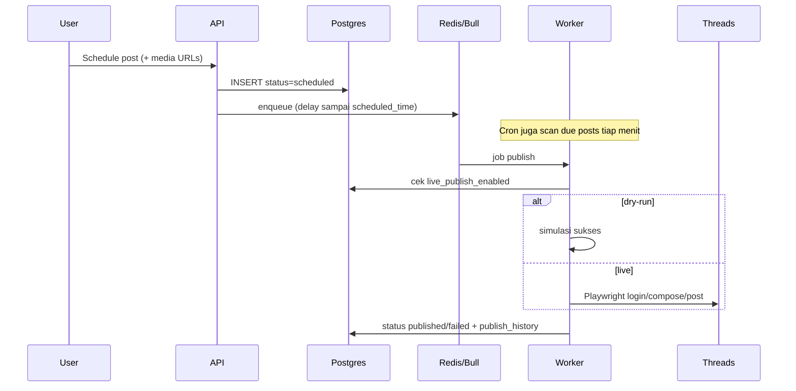

# Threads Automation — Cara Kerja

**UpdatedAt:** 25 Juli 2026 · v2.0  
**Untuk:** engineer / ops yang perlu paham alur sistem  
**Cara pakai UI:** [USER-GUIDE.md](./USER-GUIDE.md) · **Deploy:** [DEPLOY.md](./DEPLOY.md)

---

## Ringkas satu kalimat

User **jadwalkan** post (teks ± gambar) → sistem **antrikan** → saat waktunya tiba, worker **buka Threads via Playwright** → status jadi **published / failed** (+ history tiap attempt).

---

## Komponen

```
┌─────────────┐     JWT      ┌──────────────────┐
│  Frontend   │ ──────────►  │  API (Express)   │
│  React/Vite │              │  /v1 + /media    │
└─────────────┘              └────────┬─────────┘
                                      │
                    ┌─────────────────┼─────────────────┐
                    ▼                 ▼                 ▼
              PostgreSQL           Redis            Disk
              posts, users,        Bull queue       data/uploads
              settings, history    jobs
                                      │
                                      ▼
                              Worker (sama proses Node)
                              cron 1 menit + Bull
                                      │
                                      ▼
                              Playwright → threads.net
                              (atau dry-run simulasi)
```

| Bagian | Peran |
|--------|--------|
| Frontend | Login, dashboard, schedule form, settings, history |
| API | Auth JWT, CRUD posts, upload media, settings, history |
| PostgreSQL | Sumber kebenaran post + settings + publish_history |
| Redis + Bull | Antrian job publish + retry delay |
| Cron | Setiap menit scan post `scheduled` yang sudah due |
| Playwright | Browser automation login/post ke Threads |
| Upload dir | File gambar lokal, dilayani di `/media/{file}` |

**Tidak pakai Docker.** Postgres + Redis + Node jalan di host (lihat DEPLOY).

---

## Alur utama: dari schedule ke publish



### Langkah detail

1. **Create** — caption, waktu, optional `mediaUrls` (hasil upload). Status: `scheduled`.
2. **Enqueue** — job Bull dijadwalkan mendekati `scheduled_time`.
3. **Due scan** — cron `* * * * *` mengambil post due (backup jika job hilang).
4. **Resolve mode** — `dryRun = PLAYWRIGHT_DRY_RUN || !live_publish_enabled`.
5. **History pending** — insert `publish_history` sebelum attempt.
6. **Publish** — Playwright (atau simulasi): caption + attach media bila ada.
7. **Hasil**
   - Sukses → `published`, history `success`, notifikasi
   - Gagal transient → retry (max 3: ~1m / 5m / 15m)
   - Gagal permanen → `failed`, history `fail`, alert Slack (jika di-set)

---

## Status post

| Status | Arti |
|--------|------|
| `scheduled` | Menunggu waktu publish; bisa diedit / dibatalkan |
| `published` | Sudah “terpublish” (nyata atau dry-run sukses) |
| `failed` | Habis retry / error fatal; bisa **Retry** manual |
| `cancelled` | Dibatalkan (jika dipakai di alur delete) |

---

## Dry-run vs live

Dua saklar, digabung:

| | `live_publish_enabled` OFF (default) | ON |
|--|--------------------------------------|-----|
| `PLAYWRIGHT_DRY_RUN=true` | Dry-run | **Tetap dry-run** (env override aman) |
| `PLAYWRIGHT_DRY_RUN=false` | Dry-run | **Live** → post nyata ke Threads |

- Toggle live ada di **Settings** (butuh konfirmasi + banner merah di UI).
- Setiap attempt mencatat `mode: live | dry-run` di `publish_history`.
- Ops detail: [RUNBOOK.md](./RUNBOOK.md).

---

## Media

1. UI upload → `POST /v1/posts/upload-media`.
2. Validasi: MIME + magic bytes, max **5 MB**, tipe PNG/JPEG/GIF/WebP, max **4** file/post.
3. File disimpan di `UPLOAD_DIR` (default `data/uploads/`), URL `/media/{uuid}.ext`.
4. Saat publish, worker **copy ke /tmp staging** lalu `setInputFiles` di Threads compose.
5. Jika file hilang / attach gagal → **fallback text-only**, history tetap dicatat.

---

## Auth & session

1. Login: username/password Threads → Playwright validasi (atau dry-run fake session).
2. Password Threads dienkripsi at rest (`ENCRYPTION_KEY`).
3. API session = JWT (`JWT_SECRET`, default expiry 24h).
4. Cookie/session Threads disimpan untuk publish berikutnya; kalau expired, worker re-login.
5. Lockout: 5 gagal login → 15 menit.

---

## History & audit

| Tabel | Isi |
|-------|-----|
| `publish_history` | Tiap attempt publish (pending → success/fail) |
| `activity_logs` | Aksi user/sistem (CREATE, PUBLISH, …) |
| `audit_log` | Perubahan settings (toggle live) |
| `jobs` | Log eksekusi job Bull |

Retensi history: prune otomatis **> 90 hari** (cron maintenance).

---

## Notifikasi

- In-app: sukses / gagal / retry (dashboard lonceng).
- Email: Conditional SendGrid (`SENDGRID_API_KEY`) + preferensi di Settings.
- Slack: Critical fail / canary — Conditional `SLACK_WEBHOOK_URL`.

---

## Batasan penting

- Bukan official Threads API — **UI automation** (risiko ToS / selector berubah).
- Satu kelas user (bukan multi-role admin).
- Satu akun Threads per login user tool (multi-account = roadmap).
- Gambar saja di v2.0 (bukan video).

---

## Lihat juga

| Dokumen | Isi |
|---------|-----|
| [USER-GUIDE.md](./USER-GUIDE.md) | Cara pakai harian |
| [ARCHITECTURE.md](./ARCHITECTURE.md) | Diagram komponen ringkas |
| [API.md](./API.md) | Endpoint |
| [FEATURE-CATALOG.md](./FEATURE-CATALOG.md) | Available / Conditional / Roadmap |
| [DEPLOY.md](./DEPLOY.md) | Install VPS tanpa Docker |
